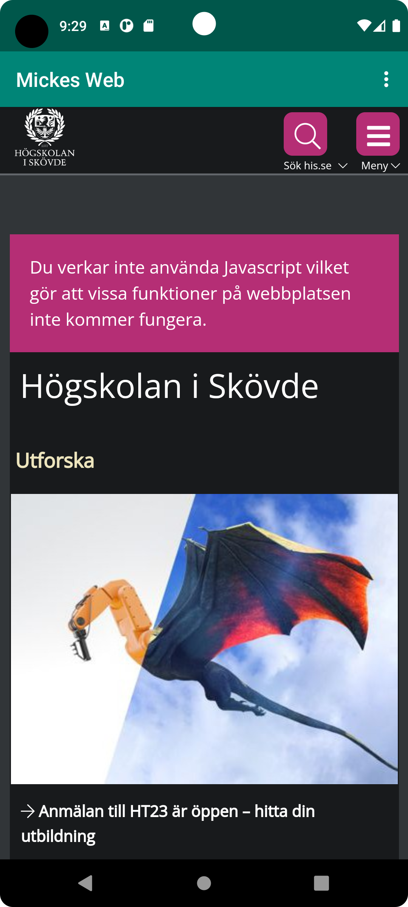
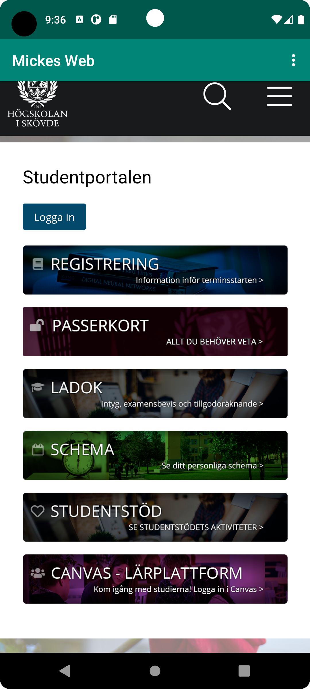

# Rapport


Först har jag skapat ett webView Element. Därefter skapade jag en WebView variabel som assignades
med ID't för WebView elementet. Denna variabel tilldelades därefter en WebView klient.
```
    <WebView
        android:layout_width="wrap_content"
        android:layout_height="wrap_content"
        android:text="@string/app_name"
        android:id="@+id/my_webview"
        app:layout_constraintBottom_toBottomOf="parent"
        app:layout_constraintEnd_toEndOf="parent"
        app:layout_constraintStart_toStartOf="parent"
        app:layout_constraintTop_toBottomOf="@+id/appBarLayout" />

</androidx.constraintlayout.widget.ConstraintLayout>

 protected void onCreate(Bundle savedInstanceState) {
        super.onCreate(savedInstanceState);
        setContentView(R.layout.activity_main);
        Toolbar toolbar = findViewById(R.id.toolbar);
        setSupportActionBar(toolbar);
        webView = findViewById(R.id.my_webview);
        webView.setWebViewClient(new WebViewClient());
  }
```

Tillsist lade jag till två olika URL:s som ska laddas in till WebViewn beroende på om man trycker på external webpage eller internal
weppage. 
```

if (id == R.id.action_external_web) {
            showExternalWebPage();
            Log.d("==>","Will display external web page");
            return true;
        }

        if (id == R.id.action_internal_web) {
            showInternalWebPage();
            Log.d("==>","Will display internal web page");
            return true;
        }
}

  public void showExternalWebPage(){
        webView.loadUrl("https://www.his.se/");
  }

  public void showInternalWebPage(){
        webView.loadUrl("https://student.his.se/");
  }
  
```



